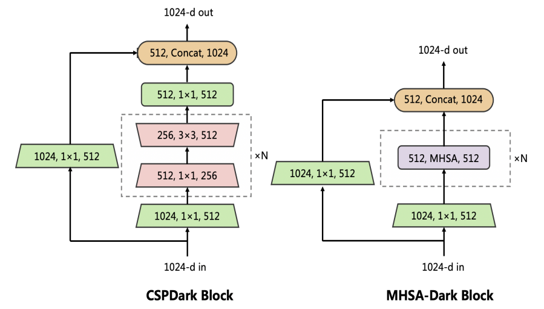
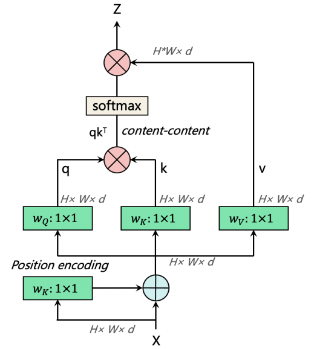

# YOLOv4 + Multi Head Self Attention (MHSA)
Object Detection using YOLOv4 + Multi Head Self Attention    
The project has been updated regularly...

#### 1. CSP-Dark Block vs MHSA-Dark Block

#### 2. MHSA-Dark Block's Layers

## To-do List
- [x] Create README
- [X] Train
- [ ] etc.

## Dependencies
- tensorflow-gpu==1.13.1
- keras==2.1.5

## References
- Paper: [ViT-YOLO:Transformer-Based YOLO for Object Detection](https://openaccess.thecvf.com/content/ICCV2021W/VisDrone/papers/Zhang_ViT-YOLOTransformer-Based_YOLO_for_Object_Detection_ICCVW_2021_paper.pdf)
- https://github.com/bubbliiiing/yolov4-keras
